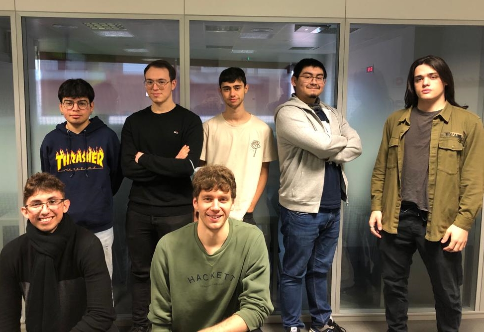
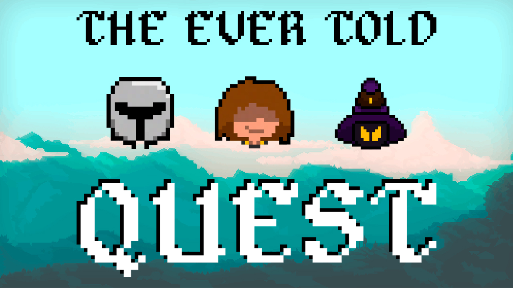

# Intro

## MATUCANA STUDIOS – PROJECT II

Matucana Studios is a group of seven students coursing the second year Bachelor's degree in Video Game Design and Development at UPC university. In this subject, Project II, we will create an RPG turn based videogame using all the concepts and resources leaned until now.

&nbsp;

## Team Members

&nbsp;

## Team Roles
- Team Lead: **Alexandre Carreras** [[ _TheGewehr_ ](https://github.com/TheGewehr)]:
  - Main Responsible set clear goals and deal with team cohesion.

- Management: **Carlos Arnau** [[ _carlosarnau_ ](https://github.com/carlosarnau)]:
  - Main Responsible of tasks track.

- QA: **Juan Fernando** [[ _FernaToty_ ](https://github.com/FernaToty)]:
  - Main Responsible of bugs track and build delivery.

- Design: **Oriol Via** [[ _guerra22_ ](https://github.com/guerra22)]:
  - Main Responsible of the game mechanics and adding challenging features.

- UI: **Allen Bateman** [[ _allenbateman_ ](https://github.com/allenbateman)]:
  - Main Responsible of the esponsiveness, feedback and ux.

- Code: **Albert Chica** [[ _AlCh440_ ](https://github.com/AlCh440)]:
  - Main Responsible of reviewing memory leaks, bugs and repository.

- Art: **Brandon Arandia** [[ _IconicGIT_ ](https://github.com/IconicGIT)]:
  - Main Responsible of the art cohesion, fx and feedback.

&nbsp;

~~~~~~~~~~~~~~~
IN ORDER OF APPERANCE
~~~~~~~~~~~~~~~

&nbsp;

## The Ever Told Quest
In a desolate world, sinked by a powerful archmage who openly defies anyone who wants to restore the world to its old glory, a party of heroes decides to face him, these heroes proved to be worthy opponents, but not enough to end the archmage’s tale, the mague, please by their worthiness markes the with a special sell, sending the party to the past and making them forget their stories.

After such encounter, the party awakes in a cave, without remembering who they are, decided to move forth, encountering a village, where after some time they recover their abilities, a local mague talks with them, reminding the who they are and offering to send them back to the future and fulfil their duty of ending the evil archmage.

&nbsp;

## Game Features

&nbsp;

## Controls
### Player movement:   

W -> Move up 

A -> Move left 

D -> Move right 

S -> Move down

Enter combat mode -> 2

Debug mode -> F9

Main menu -> 3

&nbsp;

## Other Relevance Information

&nbsp;

## License
MIT License

Copyright (c) 2021 allenbateman

Permission is hereby granted, free of charge, to any person obtaining a copy
of this software and associated documentation files (the "Software"), to deal
in the Software without restriction, including without limitation the rights
to use, copy, modify, merge, publish, distribute, sublicense, and/or sell
copies of the Software, and to permit persons to whom the Software is
furnished to do so, subject to the following conditions:

The above copyright notice and this permission notice shall be included in all
copies or substantial portions of the Software.

THE SOFTWARE IS PROVIDED "AS IS", WITHOUT WARRANTY OF ANY KIND, EXPRESS OR
IMPLIED, INCLUDING BUT NOT LIMITED TO THE WARRANTIES OF MERCHANTABILITY,
FITNESS FOR A PARTICULAR PURPOSE AND NONINFRINGEMENT. IN NO EVENT SHALL THE
AUTHORS OR COPYRIGHT HOLDERS BE LIABLE FOR ANY CLAIM, DAMAGES OR OTHER
LIABILITY, WHETHER IN AN ACTION OF CONTRACT, TORT OR OTHERWISE, ARISING FROM,
OUT OF OR IN CONNECTION WITH THE SOFTWARE OR THE USE OR OTHER DEALINGS IN THE
SOFTWARE.
